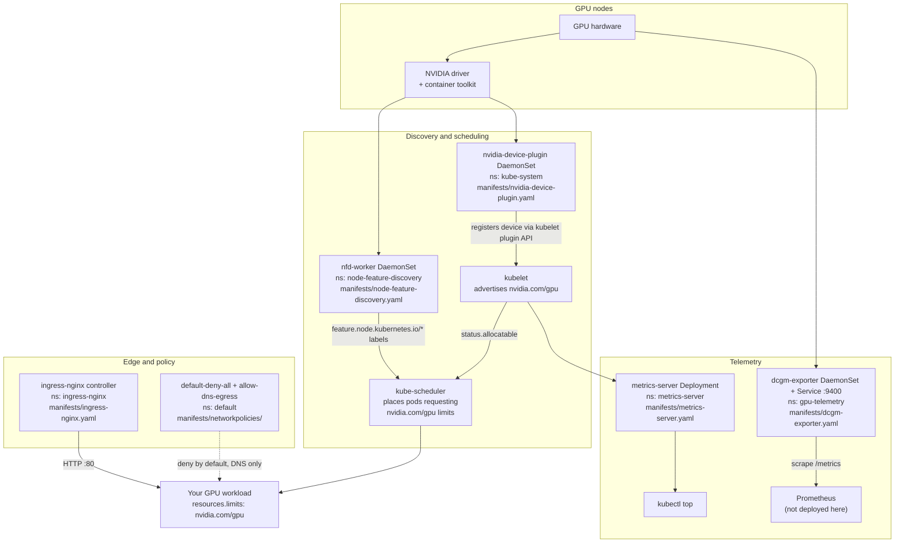

# k8s-gpu-baseline

A small, readable set of Kubernetes manifests that gets a cluster to the point
where a GPU workload can be scheduled and observed: the NVIDIA device plugin,
Node Feature Discovery, the DCGM exporter, metrics-server, an ingress
controller, and a deny-by-default NetworkPolicy pair — wired together with
Kustomize and a smoke test that tells you the truth about what is working.

Everything here is plain YAML you can read in a few minutes. There are no Helm
charts, no operators, and no hidden defaults.

## Scope

**What this is**

- A reference baseline and a teaching artifact: the minimum set of objects
  involved in GPU scheduling and telemetry, with each one visible in a single
  file.
- A starting point to fork and adapt — image tags are pinned, overlays separate
  dev from prod, and the smoke test verifies real cluster behaviour.

**What this is not**

- Not a turnkey production install. Several components ship without the RBAC
  and API registration their upstream distributions include; see
  [Known gaps](#known-gaps) below, which lists every one of them.
- Not a replacement for the [NVIDIA GPU Operator](https://docs.nvidia.com/datacenter/cloud-native/gpu-operator/latest/index.html).
  If you want driver management, MIG, node upgrades and lifecycle automation,
  use the operator. This repository exists to show what the operator is doing
  for you.
- Not affiliated with or endorsed by NVIDIA. No benchmarks, adoption claims or
  deployment history are made anywhere in this repository.

> **Note on scope history.** This repository previously also contained an
> unrelated IBM i automation toolkit (`src/ibmi_ops`, `java/`, `tests/`,
> `pyproject.toml`). That project has moved, with its file history, to
> **[TylrDn/ibmi-ops-suite](https://github.com/TylrDn/ibmi-ops-suite)**. Nothing
> GPU-related was removed.

## Architecture



## Components

| Component | Manifest | Namespace | Image (pinned) | Purpose |
|-----------|----------|-----------|----------------|---------|
| NVIDIA device plugin | `manifests/nvidia-device-plugin.yaml` | `kube-system` | `nvcr.io/nvidia/k8s-device-plugin:v0.14.5` | DaemonSet `nvidia-device-plugin-daemonset`. Privileged container, tolerates `nvidia.com/gpu:NoSchedule`, runs with `--fail-on-init-error=false`. Makes kubelet advertise `nvidia.com/gpu` as an allocatable resource. |
| Node Feature Discovery | `manifests/node-feature-discovery.yaml` | `node-feature-discovery` | `registry.k8s.io/nfd/node-feature-discovery:v0.14.0` | Namespace, ServiceAccount `nfd-worker` and DaemonSet `nfd-worker`. Detects node hardware (PCI vendor `0x10de` for NVIDIA) for `feature.node.kubernetes.io/*` labelling. Worker only — see [Known gaps](#known-gaps). |
| DCGM exporter | `manifests/dcgm-exporter.yaml` | `gpu-telemetry` | `nvcr.io/nvidia/k8s/dcgm-exporter:3.1.8-2.6.7-ubuntu20.04` | Namespace, ServiceAccount, DaemonSet and ClusterIP Service on port 9400. Exposes Prometheus GPU metrics such as `DCGM_FI_DEV_GPU_UTIL`. |
| metrics-server | `manifests/metrics-server.yaml` | `metrics-server` | `registry.k8s.io/metrics-server/metrics-server:v0.6.4` | Namespace, Deployment and Service (443 → 4443). Runs with `args: []`, i.e. kubelet TLS verification stays enabled in the base and in prod. |
| ingress-nginx | `manifests/ingress-nginx.yaml` | `ingress-nginx` | `registry.k8s.io/ingress-nginx/controller:v1.9.4` | Namespace, Deployment `ingress-nginx-controller` (port 80) and a `type: LoadBalancer` Service. |
| NetworkPolicies | `manifests/networkpolicies/` | `default` | – | `default-deny-all` (empty podSelector, Ingress + Egress, no rules) plus `allow-dns-egress` (53/UDP + 53/TCP to `k8s-app: kube-dns` in `kube-system`). |

Details, including what each object does *not* include, are in
[docs/gpu-baseline.md](docs/gpu-baseline.md) and
[docs/networking-and-security.md](docs/networking-and-security.md).

## Repository layout

```
.github/workflows/ci.yaml          render both overlays, kubeconform, pre-commit, shellcheck
docs/gpu-baseline.md               GPU lifecycle walkthrough + troubleshooting
docs/networking-and-security.md    NetworkPolicy posture and metrics-server hardening
kustomize/base/kustomization.yaml  references manifests/
kustomize/overlays/dev/            base + metrics-server --kubelet-insecure-tls
  kustomization.yaml
  metrics-server-patch.yaml
kustomize/overlays/prod/           base, unmodified (documented pass-through)
  kustomization.yaml
manifests/kustomization.yaml       the component list
manifests/dcgm-exporter.yaml
manifests/ingress-nginx.yaml
manifests/metrics-server.yaml
manifests/node-feature-discovery.yaml
manifests/nvidia-device-plugin.yaml
manifests/networkpolicies/
  kustomization.yaml
  allow-dns-egress.yaml
  default-deny-all.yaml
scripts/smoke.sh                   cluster smoke test (exit 0/1/2)
tools/kind/cluster.yaml            KIND cluster: 1 control-plane, 1 worker
Makefile                           help, kind-up, deploy-baseline, deploy-dev, render, smoke, lint, teardown
.pre-commit-config.yaml            hygiene hooks, yamllint --strict, shellcheck
.yamllint.yaml                     yamllint rules
CHANGELOG.md  CONTRIBUTING.md  SECURITY.md  CODE_OF_CONDUCT.md  LICENSE
```

## Prerequisites

- `kubectl` v1.30.2 (bundles Kustomize v5 — the overlays use the `patches:`
  syntax, not the removed `patchesStrategicMerge`)
- `docker` and `kind` for local testing
- `jq` and `curl` for the verification commands in the docs
- For actual GPU scheduling: NVIDIA drivers plus the
  [NVIDIA Container Toolkit](https://docs.nvidia.com/datacenter/cloud-native/container-toolkit/latest/install-guide.html)
  on the nodes, and a CNI that enforces NetworkPolicy if you want the policies
  to do anything

## Quickstart

Local KIND cluster (no GPU required — the GPU checks skip cleanly):

```bash
make kind-up
kubectl apply -k kustomize/overlays/dev
make smoke
```

Any GPU cluster:

```bash
kubectl apply -k kustomize/overlays/prod
./scripts/smoke.sh
```

Then walk [docs/gpu-baseline.md](docs/gpu-baseline.md) to verify each layer.

## Make targets

```console
$ make help
  help             Show this help
  kind-up          Create a local KIND cluster from tools/kind/cluster.yaml
  deploy-baseline  Apply the prod overlay (override with OVERLAY=...)
  deploy-dev       Apply the dev overlay (adds --kubelet-insecure-tls)
  render           Render both overlays to stdout to verify they build
  smoke            Run the cluster smoke test (scripts/smoke.sh)
  lint             Run pre-commit hooks and shellcheck over the repository
  teardown         Delete the local KIND cluster
```

## Overlays

| Overlay | Contents |
|---------|----------|
| `kustomize/overlays/prod` | `../../base`, nothing else. A deliberate pass-through, so cluster-specific settings have somewhere to live without touching the base. |
| `kustomize/overlays/dev` | `../../base` plus `metrics-server-patch.yaml`, which adds `--kubelet-insecure-tls` for clusters whose kubelets serve self-signed certificates (KIND). |

The complete difference between them:

```console
$ diff <(kubectl kustomize kustomize/overlays/prod) <(kubectl kustomize kustomize/overlays/dev)
107c107,108
<       - args: []
---
>       - args:
>         - --kubelet-insecure-tls
```

## Validation

```bash
make render                                   # both overlays must build
kubectl kustomize kustomize/overlays/prod | kubeconform -strict -
kubectl kustomize kustomize/overlays/dev  | kubeconform -strict -
pre-commit run --all-files
shellcheck scripts/smoke.sh
```

Pinned tool versions used in CI: `kubectl` v1.30.2, `kubeconform` v0.6.4.

## Known gaps

Stated up front so nothing here is a surprise in a cluster:

| Gap | Effect | Where to get the missing piece |
|-----|--------|-------------------------------|
| No `v1beta1.metrics.k8s.io` APIService, ServiceAccount or RBAC for metrics-server | `kubectl top` reports `Metrics API not available` | [metrics-server upstream](https://github.com/kubernetes-sigs/metrics-server) |
| No `nfd-master` (and no NFD RBAC) | `nfd-worker` runs but no `feature.node.kubernetes.io/*` labels appear | [NFD deployment docs](https://kubernetes-sigs.github.io/node-feature-discovery/stable/deployment/kustomize.html) |
| No ServiceAccount, RBAC or IngressClass for ingress-nginx | The controller cannot watch Ingress objects and will not serve traffic on its own | [ingress-nginx install guide](https://kubernetes.github.io/ingress-nginx/deploy/) |
| No Prometheus, ServiceMonitor or Grafana dashboards | The DCGM exporter is scrapeable but nothing scrapes it | Point your existing Prometheus at `dcgm-exporter.gpu-telemetry.svc:9400` |
| NetworkPolicies cover only the `default` namespace, and need a policy-enforcing CNI | On kindnet or plain flannel they are accepted and silently ignored | [docs/networking-and-security.md](docs/networking-and-security.md) |
| No resource requests/limits, no PodSecurity admission labels, no TLS on the ingress Service | Not production-safe defaults | [docs/networking-and-security.md](docs/networking-and-security.md) |
| Images pinned by tag, not digest | Tags are mutable | Repin as `image@sha256:...` if you need reproducibility |

## Documentation

| Document | Contents |
|----------|----------|
| [docs/gpu-baseline.md](docs/gpu-baseline.md) | Lifecycle walkthrough: NFD → device plugin → GPU pod → DCGM → metrics-server → smoke test, with a troubleshooting table |
| [docs/networking-and-security.md](docs/networking-and-security.md) | Deny-by-default posture, rules you must add for your own workloads, metrics-server hardening |
| [CONTRIBUTING.md](CONTRIBUTING.md) | Local checks, commit conventions, versioning and release checklist |
| [CHANGELOG.md](CHANGELOG.md) | Keep a Changelog / SemVer history |
| [SECURITY.md](SECURITY.md) | How to report a vulnerability, and the known security-relevant defaults |
| [CODE_OF_CONDUCT.md](CODE_OF_CONDUCT.md) | Contributor Covenant 2.1 |

## CI

`.github/workflows/ci.yaml` runs on every push and pull request: it renders
**both** overlays, validates each against Kubernetes schemas with `kubeconform
-strict`, runs `pre-commit` over all files, and shellchecks `scripts/smoke.sh`.
Tool versions are pinned in the workflow's `env` block.

## License

MIT — see [LICENSE](LICENSE).
